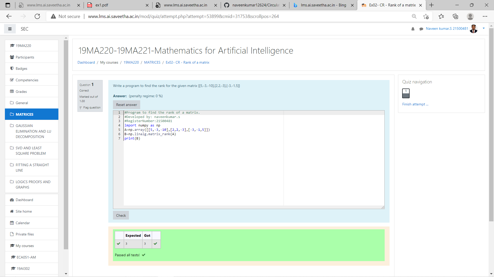

# RANK-OF-A-MATRIX
## Aim:
To write a python program to find the rank of a matrix
## Equipment’s required:
1. 	Hardware – PCs
2. 	Anaconda – Python 3.7 Installation / Moodle-Code Runner
## Algorithm:
### Step 1: 
import the numpy
### Step 2: 
using given values,make arrays and name it as 'A'
### Step 3: 
Using the np.linalg.matrix_rank() and name it as 'B', we can find the rank of the given matrix.
### Step 4: 
print 'B' and end the programme.
## Program:
~~~
#Program to find the rank of a matrix.
#Developed by: naveenkumar.s
#RegisterNumber:21500481
import numpy as np
A=np.array([[5,-3,-10],[2,2,-3],[-3,-1,5]])
B=np.linalg.matrix_rank(A)
print(B)
~~~
## Output:

## Result:
Thus the rank for the given matrix is successfully solved by  using a python program.

